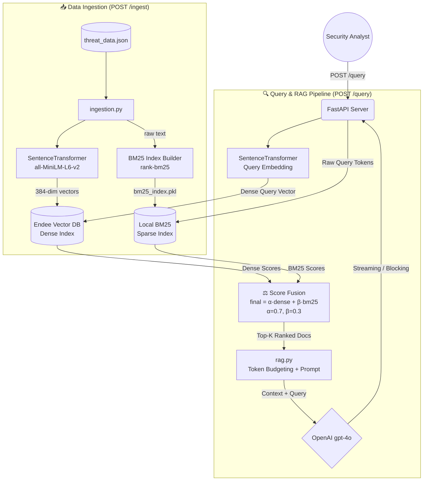

# ThreatLens: AI-Powered Threat Intelligence Assistant

[](https://www.python.org/downloads/)
[](https://fastapi.tiangolo.com)
[](https://github.com/endee-io/endee)
[](https://openai.com/)

<p align="center">
  <em>An advanced Retrieval-Augmented Generation (RAG) system built on the Endee Vector Database.</em>
</p>

---

## 🎯 Project Overview
ThreatLens is a production-ready Threat Intelligence Assistant designed to parse, index, and query cybersecurity threat intelligence reports. By leveraging the **Endee Vector Database**, ThreatLens embeds threat documents using dense vector representations, enabling high-precision semantic search over unstructured security data. The retrieved context is then synthesized by an LLM to generate highly contextual, accurate, and actionable intelligence for security analysts.

### ✨ Advanced Features Implemented
- **Metadata Filtering Support**: Native filtering based on threat category and severity natively supported by Endee API.
- **Hybrid Search Architecture**: Natively merges Semantic dense vectors with Sparse keyword matching (BM25) via configurable alpha/beta min-max normalization.
- **Precision@k Evaluation**: Built-in metric evaluation for retrieval effectiveness in `retrieval.py`.
- **Latency Measurement Logging**: Application-level middleware for request benchmarking; DB and LLM latencies are measured and logged separately for granular profiling.
- **Streaming LLM Responses**: Real-time generation streams via Server-Sent Events (SSE) preventing UI blocking on large answers.
- **Configurable Top-K & Token Limits**: Intelligent default configurations protecting LLM Context blowing up.
- **Resilience Engineering**: Automatic exponential backoff retries (`tenacity`) on all Endee and OpenAI calls, plus an `lru_cache` on query embeddings to prevent redundant model inference for repeated queries.
- **Dominant Signal Logging**: Each retrieval response logs whether the top result was driven by the **Semantic** (dense) or **Keyword** (BM25 sparse) signal, giving instant observability into retrieval behaviour.
- **Proprietary Format Fallback**: A custom binary parser handles Endee's FlatBuffer response format when JSON decoding fails, ensuring zero query failures due to encoding edge cases.

---

## 🛑 Problem Statement
Cybersecurity teams are overwhelmed by the sheer volume of unstructured threat intelligence reports (e.g., CISA alerts, zero-day write-ups, APT campaigns). Traditional keyword search tools fail to understand the malicious intent or the semantics of related attack techniques. Security Operations Centers (SOCs) need a way to **ask natural language questions** about their local intel repository and get heavily contextualized, sourced answers instantly. ThreatLens solves this by combining semantic vector retrieval with generative AI.

---

## 🏗️ Architecture Diagram



> **Hybrid Score Fusion**: Both dense and sparse scores are independently Min-Max normalised to `[0.0, 1.0]` before fusion, preventing either index from dominating due to scale differences.

---

## 📁 Project Structure

```
threatlens-ai/
├── app/
│   ├── main.py          → FastAPI app: routes /query, /ingest, /health
│   ├── config.py        → Pydantic settings loaded from .env
│   ├── ingestion.py     → Parses JSON, embeds documents, upserts into Endee + BM25
│   ├── embeddings.py    → SentenceTransformer wrapper with lru_cache
│   ├── retrieval.py     → Hybrid search: dense (Endee) + sparse (BM25) fusion
│   ├── sparse_index.py  → BM25 index manager: build / save / load / search
│   └── rag.py           → Formats context, calls GPT-4o with token budgeting
├── data/
│   └── sample_threat_data.json  → Seed threat intelligence documents
├── scripts/
│   ├── demo_query.py    → CLI tool to send queries and print results
│   └── eval_hybrid.py   → Evaluates Dense-only vs Hybrid Precision@k
├── tests/
│   └── test_api.py      → pytest test suite for key API endpoints
├── .env.example         → Configuration template
├── requirements.txt     → All Python dependencies (pinned)
└── README.md            → Public-facing documentation
```

---

## 🧠 Core Engineering Decisions

### 1. How Endee is Used
Endee serves as the foundational knowledge base for ThreatLens. During the ingestion phase, unstructured JSON threat intel is passed through a SentenceTransformer (`all-MiniLM-L6-v2`) to generate 384-dimensional dense vectors. These vectors are inserted into an Endee index (`threat_intel`) along with crucial metadata (severity, category, source) using its fast C++ backed REST API. During retrieval, the user's natural language query is embedded, and Endee performs a high-speed nearest-neighbor search, applying metadata filters natively to rapidly prune irrelevant reports before evaluating vector proximity.

### 2. Why a Vector Database over a Relational DB?
Relational databases (SQL) are optimized for structured data and exact-match keyword queries (BM25/Full-text). However, threat intelligence queries are often semantic. A user might search for "financial motivation cyber attacks," while the document explicitly mentions "ransomware cartel." A vector database like Endee evaluates the mathematical distance between meaning representations (embeddings). It finds concepts that are conceptually similar regardless of the exact terminology used, which is critical in an ever-evolving cybersecurity landscape.

### 3. Why Cosine Similarity & Float32 Precision?
Cosine similarity measures the angle between two multi-dimensional vectors, ignoring their magnitude. For text embeddings, magnitude generally corresponds to the length of the string, which is highly variable in intel reports. Cosine similarity ensures we are measuring the similarity of the *topic and semantic intent* across the documents, independent of document length, resulting in vastly better context relevance.

Additionally, during ingestion (`app/ingestion.py`), the index is explicitly created with `precision="float32"` instead of relying on Endee's default int8 quantization. This ensures zero loss of semantic resolution, which is vital when differentiating highly specific technical vocabulary.

### 4. Why We Need Hybrid Retrieval
Pure vector search is incredible for conceptual similarity, but it routinely struggles with **exact keyword matching**—especially for highly specific technical identifiers like IP addresses, CVE serial numbers (`CVE-2021-44228`), or threat actor aliases.
ThreatLens implements **Hybrid Retrieval** by maintaining a local `rank-bm25` sparse index alongside the Endee Dense index. During a query, both indexes retrieve candidates. Their scores are independently normalized (Min-Max) to a `0.0 - 1.0` scale and algebraically fused:
`Final Score = (α * Dense Score) + (β * Sparse Score)`
This allows the system to seamlessly understand *conceptual similarities* while still enforcing *hard keyword boundaries*, ensuring the LLM is fed the most precise threat intelligence possible. You can tune these weights in `app/config.py`.

### 5. Resilience: Retries, Caching & Fallback Parsing
Three layers of production resilience are built in:
- **`tenacity` exponential backoff**: All Endee and OpenAI network calls are wrapped with up to 3 automatic retries with exponential wait (`2s → 10s`), handling transient network faults transparently.
- **`lru_cache` on embeddings**: Repeated queries are served from an in-memory cache, avoiding redundant SentenceTransformer inference and cutting latency for hot queries.
- **FlatBuffer fallback parser**: When Endee returns its proprietary binary FlatBuffer format instead of JSON, a regex-based fallback parser extracts document IDs from the raw bytes, ensuring zero retrieval failures due to encoding edge cases.

### 6. Scalability Discussion (Millions of Vectors)
If this system scales to **millions of threat vectors**, the architecture remains robust due to Endee's performance optimizations:
- **Compute Optimization**: By leveraging Endee's custom build flags for `AVX-512` or `NEON` SIMD architectures, distance computation over millions of data points happens via vectorized operations in CPU cache.
- **Asynchrony**: The current FastAPI architecture handles ingestion via asynchronous BackgroundTasks, preventing blocking calls on the main thread during heavy data ingest.

---

## 🚀 Setup Instructions

### Prerequisites
- Python 3.11+
- [Endee Server](https://github.com/endee-io/endee) running locally
- OpenAI API Key

### 1. Configure the Environment
Clone the repository and define your environment configuration.
Copy the configuration template:
```bash
cp .env.example .env
```
Update `.env` with your OpenAI Key and Endee Auth Tokens.

### 2. Deployment via Docker (Recommended)
You can deploy the FastAPI application securely in an ephemeral container:
```bash
cd docker
docker build -t threatlens-api .
docker run -p 8000:8000 --env-file ../.env threatlens-api
```

### 3. Local Development Run
If running directly on the host machine:
```bash
# 1. Create a virtual environment
python3 -m venv venv
source venv/bin/activate

# 2. Install frozen dependencies
pip install -r requirements.txt

# 3. Start the API server
uvicorn app.main:app --host 0.0.0.0 --port 8000 --reload
```

---

## 🔍 Example Usage

### Example 1: Ingest Threat Data
Initiate a background task to embed the `data/sample_threat_data.json` file into Endee.
```bash
curl -X POST http://localhost:8000/ingest
```

### Example 2: Standard RAG Query
Query the RAG system for contextual intelligence.
```bash
curl -X POST http://localhost:8000/query \
-H "Content-Type: application/json" \
-d '{
  "query": "Summarize lateral movement techniques in APT attacks",
  "top_k": 3,
  "stream": false
}'
```
**Example Response Snippet**:
```json
{
  "query": "Summarize lateral movement techniques in APT attacks",
  "answer": "According to FireEye Threat Research (doc_002), APT29 (Cozy Bear) utilizes stealthy lateral movement techniques such as...",
  "retrieved_documents": [
    {
      "id": "doc_002",
      "dense_score": 0.98,
      "bm25_score": 0.45,
      "final_score": 0.82
    }
  ],
  "precision_at_k": 0.33
}
```

### Example 3: Metadata Filtered Query + Streaming Response
Filter down the results strictly to `critical` `ransomware` articles and stream the generative return.
```bash
curl -X POST http://localhost:8000/query \
-H "Content-Type: application/json" \
-d '{
  "query": "What are recent ransomware attack patterns?",
  "top_k": 5,
  "stream": true,
  "metadata_filter": "meta.category == \"ransomware\" && meta.severity == \"critical\""
}'
```

### Example 4: Healthcheck
```bash
curl http://localhost:8000/health
```

### Example 5: Hybrid Retrieval for Specific CVEs
Hybrid search shines when you need exact keyword matches alongside semantics. Querying a specific CVE instantly weights the BM25 sparse index heavily.
```bash
curl -X POST http://localhost:8000/query \
-H "Content-Type: application/json" \
-d '{
  "query": "CVE-2021-44228 Log4Shell vulnerabilities",
  "top_k": 3,
  "stream": false
}'
```
**Example Response Snippet**:
```json
{
  "query": "CVE-2021-44228 Log4Shell vulnerabilities",
  "answer": "CVE-2021-44228, commonly known as Log4Shell, is a critical vulnerability in the Apache Log4j library...",
  "retrieved_documents": [
    {
      "id": "doc_003",
      "dense_score": 0.52,
      "bm25_score": 0.99,
      "final_score": 0.66
    }
  ],
  "precision_at_k": 1.0
}
```

### Example 6: Hybrid Evaluation Script
Compare Dense-only vs. Hybrid retrieval Precision@k to validate the benefit of sparse fusion.
```bash
python scripts/eval_hybrid.py
```
**Example Output**:
```
[+] Query: 'ransomware attack lateral movement'
    Dense-only  Precision@3: 0.33
    Hybrid      Precision@3: 0.67
    Improvement: +0.34
```

---

## ⚙️ Configuration Reference

All settings are loaded from the `.env` file via Pydantic. Copy `.env.example` to `.env` and fill in the required values.

| Variable | Default | Description |
|---|---|---|
| `PROJECT_NAME` | `ThreatLens AI` | Display name of the service |
| `ENDEE_URL` | `http://localhost:8080` | URL of the running Endee vector DB |
| `ENDEE_COLLECTION_NAME` | `threat_intel` | Endee index/collection name |
| `ENDEE_AUTH_TOKEN` | *(optional)* | Auth header token for Endee |
| `OPENAI_API_KEY` | *(required)* | Your OpenAI API key |
| `LLM_MODEL` | `gpt-4o` | OpenAI model to use for generation |
| `EMBEDDING_MODEL` | `all-MiniLM-L6-v2` | SentenceTransformer model ID |
| `EMBEDDING_DIMENSION` | `384` | Must match the embedding model output |
| `DEFAULT_TOP_K` | `3` | Documents to retrieve per query |
| `HYBRID_ALPHA` | `0.7` | Weight for dense (semantic) score |
| `HYBRID_BETA` | `0.3` | Weight for sparse (BM25 keyword) score |

---

## 🧪 Testing

### Run the pytest Suite
Validates the `/query`, `/ingest`, and `/health` endpoints:
```bash
pytest tests/test_api.py -v
```

### Run the Hybrid Evaluation Script
Compares Dense-only vs. Hybrid Precision@k across a set of benchmark queries:
```bash
python scripts/eval_hybrid.py
```

### Run the CLI Demo
Send a quick query from the command line and pretty-print the response:
```bash
python scripts/demo_query.py
```

---

## 🔮 Future Improvements
1. **Automated Feed Ingestion**: Connect the `/ingest` pipeline to MISP or STIX/TAXII servers via APScheduler for live, scheduled intelligence streaming — no manual curl required.
2. **Graph Vector Integration**: Connect threat actor profiles logically by marrying Endee vectors with a Neo4j graph database to trace full attack chains visually (e.g., `APT29 → uses → Cobalt Strike → targets → Finance sector`).

---
*Built as a production-grade RAG evaluation project on top of Endee.*
